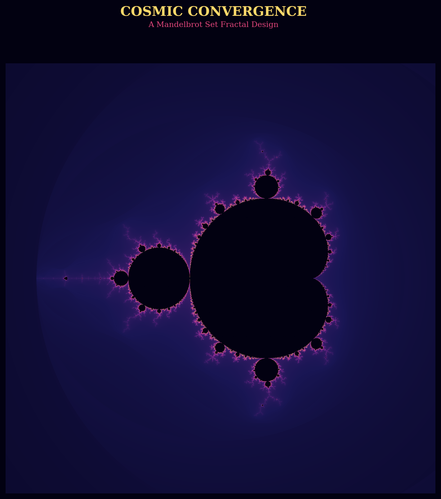

## Student Details

- **Name:** \<Huzaifa Maqbool>
- **Registration Number:** \<556377\>
- **Course / Lab:** BS(CS) — Design Lab 01, Designing Using Fractals# Cosmic Convergence — A Mandelbrot Fractal Design

A generative art piece built for **Design Lab 01: Designing Using Fractals** (BS Computer Science). It renders a smoothly-shaded Mandelbrot set using a custom hand-built "nebula" color gradient and gamma correction to bring out fine boundary detail.



> Replace the image above with your own exported `cosmic_convergence.png` before submitting — see **Setup & Run Instructions** below.

## Fractal Type Implemented

- **Mandelbrot Set** — rendered with the smooth (continuous) escape-time coloring algorithm to avoid visible banding, at high resolution (1800×1800).

## Creative Design Choices

- **Custom color gradient** — an 8-stop hand-tuned palette (navy → indigo → violet → magenta → rose → ember → gold → white) built with `LinearSegmentedColormap`, rather than a default matplotlib colormap.
- **Gamma correction** (`data ** 0.45`) applied before coloring to bring out delicate boundary detail that would otherwise be crushed toward black.
- **Smooth coloring formula** using the continuous escape-time estimate, so gradients flow rather than stepping in visible bands.

## Tools, Languages & Libraries Used

| Tool | Purpose |
|---|---|
| Python 3 | Core implementation |
| [NumPy](https://numpy.org/) | Vectorized complex-plane iteration (fast escape-time computation) |
| [Matplotlib](https://matplotlib.org/) | Rendering and the custom colormap |
| Google Colab | Development / execution environment |

No other third-party or open-source code was used beyond the libraries listed above.

## Setup & Run Instructions

### Option A — Google Colab (recommended, zero install)
1. Go to [colab.research.google.com](https://colab.research.google.com) and create a new notebook.
2. Copy the entire contents of `fractal_design.py` into a single code cell.
3. Run the cell (**Shift+Enter**). Colab already has NumPy and Matplotlib installed.
4. After it finishes, `cosmic_convergence.png` appears in the Colab file browser (folder icon on the left).
5. Download it (right-click → Download, or let the built-in `files.download()` call at the bottom of the script trigger automatically).

### Option B — Locally
```bash
pip install numpy matplotlib
python fractal_design.py
```
The output file is written to the current working directory.

## Repository Contents

```
.
├── fractal_design.py       # Full source code (Mandelbrot fractal design)
├── README.md                # This file
└── cosmic_convergence.png   # Exported fractal design (add your own render)
```


## Academic Integrity

This implementation was written from scratch for this lab. It uses only the open-source libraries credited above (NumPy, Matplotlib, Pillow) for numerical computation and rendering — no fractal-generation code was copied from external sources.
